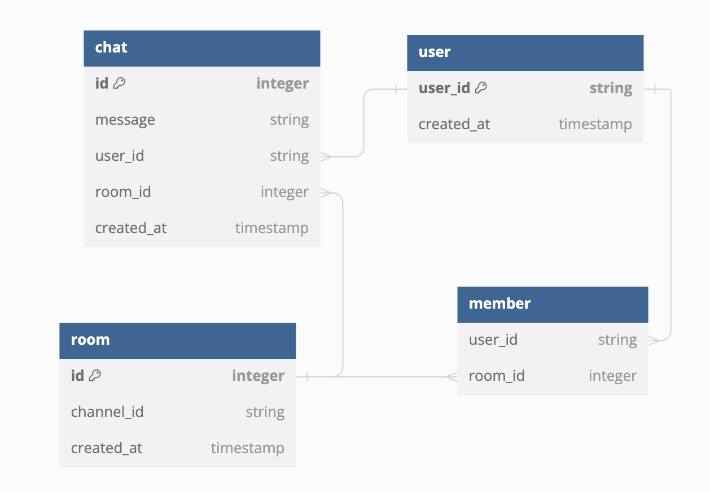
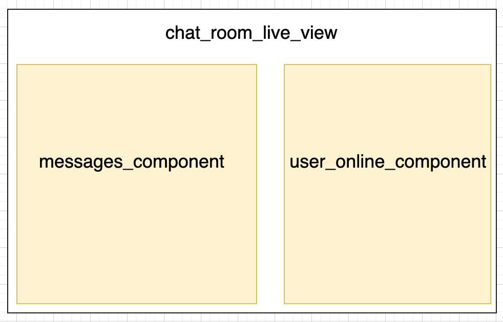

# ChatService (LiveView)

To start your Phoenix server:

  * Run `mix deps.get` to install dependencies
  * Run `mix ecto.create` to create the storage for the given repository.
  * Run `mix ecto.gen.migration *name of file*` to generates a new migration for the repo.
  * Run `mix ecto.migrate` to runs the repository migratio
  * Start Phoenix endpoint with `mix phx.server` or inside IEx with `iex -S mix phx.server`

Now you can visit [`[localhost:4000](http://localhost:4000/chat_room?user_id=john&game_id=game_1)`](http://localhost:4000/chat_room?user_id=john&game_id=game_1) from your browser.

+ `http://localhost:4000/chat_room?user_id=john&game_id=game_1`

+ `game_1` is room and `john` is user

## Database:

## Model
lib/chat_service/room
=> model chat room

priv/repo/migrations/*_create_room_table.exs
=> Migrations are used to modify your database schema over time.

## View

## Controller

+ lib/chat_service_web/controllers/room_channels/chat_room_live_view.ex
 => Handle main live view, handle user joins room and send message, add user by clicking button

 + lib/chat_service_web/controllers/room_channels/messages_component.ex
 => Use live component for update history message

 + lib/chat_service_web/controllers/room_channels/user_online_component.ex
=> Use live component for storing user in room

## Channel

## Use case

# First user joins room

Flow:

```mermaid
sequenceDiagram
    actor User1
    participant game_channel
    participant chat_room_live_view
    participant user_online_component
    participant messages_component
    User1->>chat_room_live_view: Mount page (1)
    Note right of chat_room_live_view: PubSub.subscribe(topic::game_id)
    chat_room_live_view->>user_online_component: update all users in room ([users]) (2)
    chat_room_live_view->>messages_component: update all history message of room ([user, message]) (3)
    Note right of User1: app.js
    User1->>game_channel: User1 joins channel (game)
    Note right of game_channel: PubSub.broadcast(topic::game_id)
    game_channel->>chat_room_live_view: PubSub sends join_room
    chat_room_live_view->>user_online_component: do notthing
```

# Second user joins room

Flow:

```mermaid
sequenceDiagram
    box User2
    actor User2
    participant game_channel
    participant chat_room_live_view (2)
    participant user_online_component (2)
    end
    box User1
    participant chat_room_live_view (1)
    participant user_online_component (1)
    end
    Note right of game_channel: Same as 1, 2, 3 step of first user joins room
    Note right of User2: app.js
    User2->>game_channel: User2 joins channel (game)
    Note right of game_channel: PubSub.broadcast(topic::game_id)
    par Parallelly
    game_channel->>chat_room_live_view (2): PubSub sends join_room
    chat_room_live_view (2)->>user_online_component (2): do notthing
    and
    game_channel->>chat_room_live_view (1): PubSub sends join_room
    chat_room_live_view (1)->>user_online_component (1): update all users in room ([users]) (2)
    end
```

# User sends messages

Flow:

```mermaid
sequenceDiagram
    box User2
    actor User2
    participant game_channel
    participant chat_room_live_view (2)
    participant messages_component (2)
    end
    box User1
    participant chat_room_live_view (1)
    participant messages_component (1)
    end
    Note right of User2: app.js
    User2->>game_channel: User sends message via channel (game)
    Note right of game_channel: PubSub.broadcast(topic::game_id)
    par Parallelly
    game_channel->>chat_room_live_view (2): PubSub sends send_msg
    chat_room_live_view (2)->>messages_component (2): update all messages
    and
    game_channel->>chat_room_live_view (1): PubSub sends send_msg
    chat_room_live_view (1)->>messages_component (1): update all messages
    end
```

# Add user to room

Flow:

```mermaid
sequenceDiagram
    box User1
    actor User1
    participant chat_room_live_view (1)
    participant user_online_component (1)
    end
    box User2
    participant chat_room_live_view (2)
    participant user_online_component (2)
    end
    box User3
    participant chat_room_live_view (3)
    participant user_online_component (3)
    end
    Note right of User1: phx-submit event
    User1->>chat_room_live_view (1): User adds another user to room
    Note over chat_room_live_view (1): handle_event
    Note right of chat_room_live_view (1): PubSub.broadcast(topic::game_id)
    par Parallelly
    chat_room_live_view (1)->>chat_room_live_view (1): PubSub sends add users
    chat_room_live_view (1)->>user_online_component (1): update all users in room
    and
    chat_room_live_view (1)->>chat_room_live_view (2): PubSub sends add users
    chat_room_live_view (2)->>user_online_component (2): update all users in room
    and
    chat_room_live_view (1)->>chat_room_live_view (3): PubSub sends add users
    chat_room_live_view (3)->>user_online_component (3): update all users in room
    end
```

# User leaves room

Flow:

```mermaid
sequenceDiagram
    box User1
    actor User1
    participant game_channel (1)
    participant chat_room_live_view (1)
    end
    box User2
    participant chat_room_live_view (2)
    participant user_online_component (2)
    end
    box User3
    participant chat_room_live_view (3)
    participant user_online_component (3)
    end
    User1->>game_channel (1): User leaves room
    Note over game_channel (1): handle_in
    Note right of game_channel (1): PubSub.broadcast (topic::game_id)
    par Parallelly
    game_channel (1) ->> chat_room_live_view (1): PubSub sends user leaves room
    Note over chat_room_live_view (1): handle_info
    chat_room_live_view (1)->>chat_room_live_view (1): redirect to another page
    and
    game_channel (1) ->> chat_room_live_view (2): PubSub sends user leaves room
    Note over chat_room_live_view (2): handle_info
    chat_room_live_view (2)->>user_online_component (2): update all users in room
    and
    game_channel (1) ->> chat_room_live_view (3): PubSub sends user leaves room
    Note over chat_room_live_view (3): handle_info
    chat_room_live_view (3)->>user_online_component (3): update all users in room
    end
```
